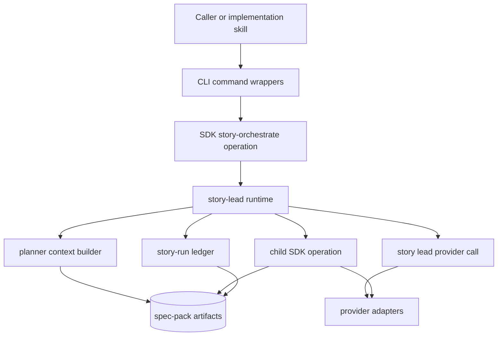
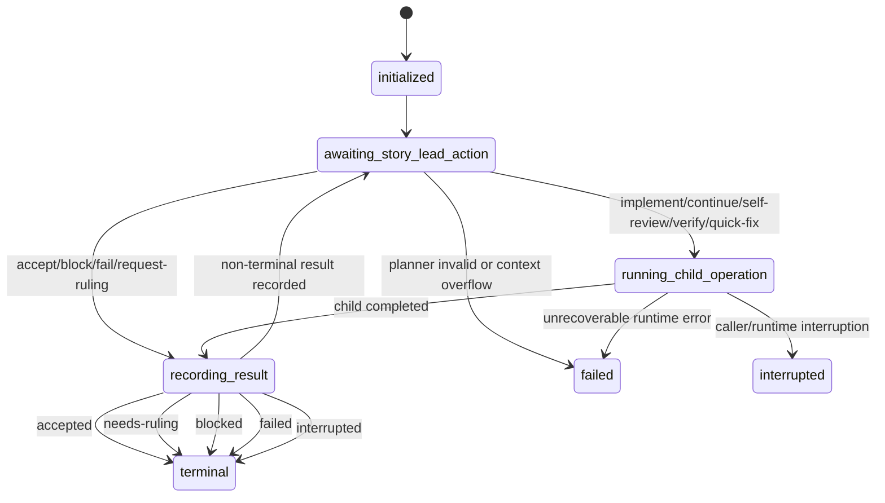
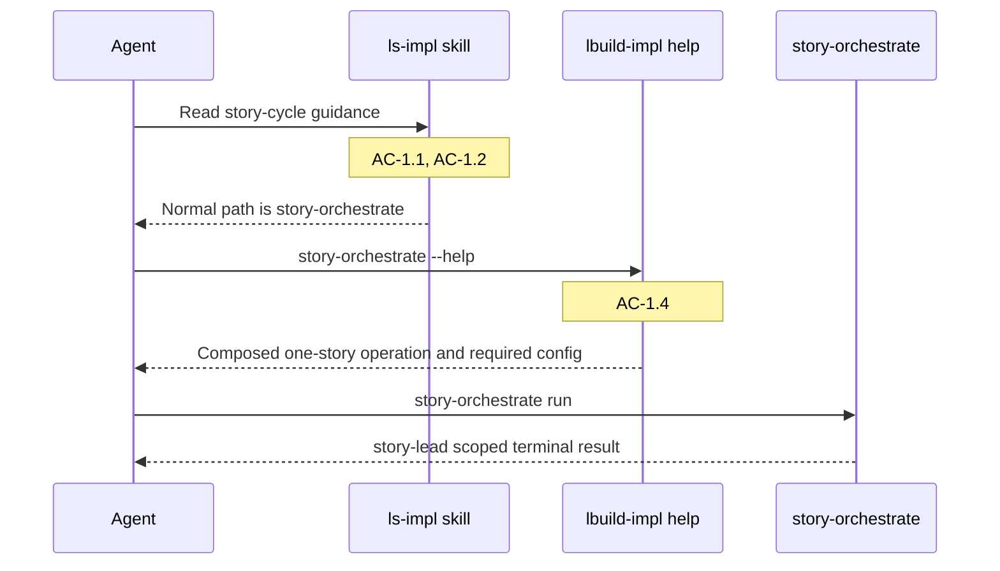
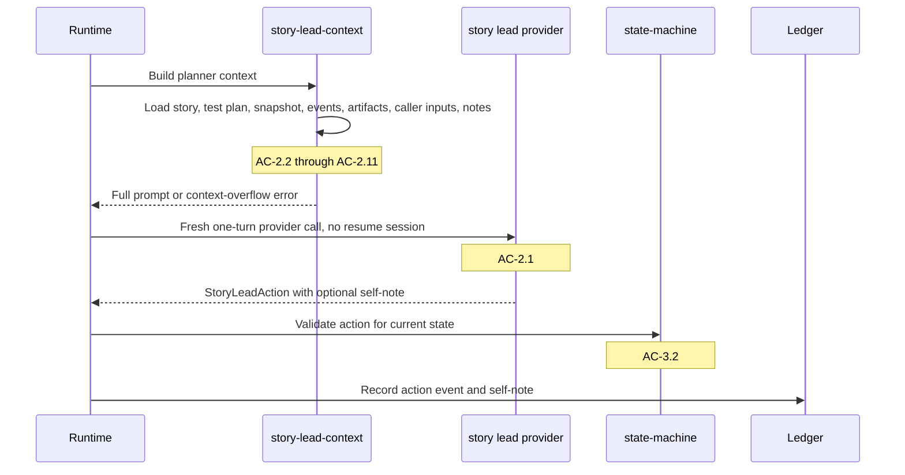
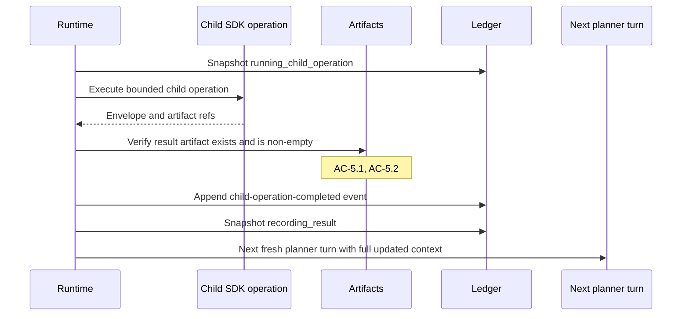
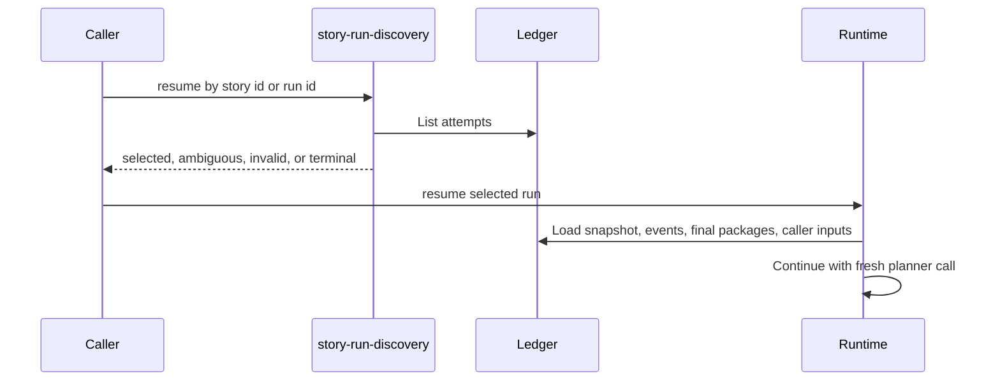

# Technical Design: Story-Orchestrate Hardening and Process Refinement

## Purpose

This design translates the Epic 04 requirements into an implementation plan for `lbuild-impl@0.4.0`. The work hardens the story-level orchestration loop introduced in Epic 03. It makes `story-orchestrate` the normal story execution path, removes hidden story-lead conversation memory, passes full durable story-run context into every planner turn, and fixes provider/runtime reliability issues found while dogfooding Epic 03.

The design uses Config A: this `tech-design.md` plus [test-plan.md](/Users/leemoore/code/lspec-core/docs/spec-build/epics/04-story-orchestrate-hardening/test-plan.md). A companion-doc split is not needed because the system is a focused CLI/SDK runtime with one main domain: implementation orchestration.

## Spec Validation

The epic is ready for design. It defines the behavior and boundary contracts needed for implementation without forcing low-level internal names. The design below makes those internal choices concrete.

| Issue | Spec Location | Resolution | Status |
|-------|---------------|------------|--------|
| Earlier process decision excluded a standalone tech design | Out of Scope | Removed the stale out-of-scope line because the current handoff explicitly requests this tech design | Resolved |
| Generic tech-design guidance allows placeholder integration skips before a suite exists | `ls-tech-design` verification script guidance; Epic AC-5.4 | This repo already has an integration suite. This design follows the epic-specific rule: choosing not to run integration is allowed, but an invoked integration suite must fail when prerequisites are missing | Resolved - deviated |
| Current prompt assembly includes tech-design paths for story lead prompts | AC-2.6, AC-2.11 | Replace story-lead prompt assembly with a story-lead-specific context builder that includes story and test plan, excludes epic/tech design/git state, and embeds required artifacts in full | Resolved |
| Current snapshot schema can persist `storyLeadSession` | AC-2.1 | Remove story-lead planner session persistence from story-run snapshots. Child operation continuation handles remain allowed | Resolved |
| Current config accepts `story_lead` as a deprecated alias | AC-4.2 | Remove alias acceptance and transform. Missing `story_lead_provider` fails before story work starts | Resolved |

## Context

Epic 03 introduced the composed story operation. The current runtime already has a story-run ledger, story-run discovery, final-package assembly, caller heartbeats, primitive child operations, and provider adapters for Claude Code, Codex, and Copilot. The new work should preserve those surfaces while tightening the boundary between the runtime and the story lead.

The main design change is ownership of memory. Today the story-lead flow can preserve a story-lead provider session and resume it later. Epic 04 changes the planner into a one-action stateless call. The runtime owns durable state. Each planner turn receives the full story-run record, returns one bounded action, and exits. The next turn is a fresh provider call over the updated record.

This design treats the durable story-run record as the thread. It includes the active story file, full test plan, current snapshot, full event history, full prior result artifacts, caller input artifacts, and all prior story-lead self-notes. The runtime must not summarize or trim those required inputs to keep going. If the selected provider cannot accept the full required context, the run fails with an explicit context-overflow error.

Provider and platform hardening are part of the same release because `story-orchestrate` depends on them. A stateless planner cannot be reliable if child operations disappear behind stale processes, empty artifacts, broken Windows path handling, or integration tests that skip when they should fail. The design therefore covers runtime state, provider liveness, evidence durability, integration gate behavior, Windows support, and version `0.4.0` as one hardening release.

## System View

### Runtime Loop

`story-orchestrate` remains a CLI and SDK operation. The CLI wrappers stay thin. The SDK operation loads the spec pack, resolves story-run state, creates or resumes a ledger attempt, and delegates the run loop to core runtime modules.



The story lead provider is not allowed to hold continuity across planner turns. The provider can still return a session id as an execution detail, but story-lead runtime ignores it for future planner calls. Child operations can continue using their own continuation handles because they are separate operations with their own result contracts.

### State Machine

The runtime owns a small, explicit state machine. Keep the existing coarse public `status` vocabulary for snapshot/result compatibility: `running`, `accepted`, `needs-ruling`, `blocked`, `failed`, and `interrupted`. Add a separate lifecycle field for the non-terminal state-machine position. This avoids turning a hardening epic into an artifact migration unless implementation discovers a hard reason to migrate.



Lifecycle names are persisted in snapshots and status output beside the existing public status. Terminal results remain the public outcome vocabulary: `accepted`, `needs-ruling`, `blocked`, `failed`, and `interrupted`.

### External Boundaries

The design mocks external boundaries in tests and exercises internal modules through public entry points.

| Boundary | Runtime Module | Test Strategy |
|----------|----------------|---------------|
| Provider processes | `src/core/provider-adapters/*`, `src/core/provider-adapters/shared.ts` | Mock child process spawn/exec or fake provider binaries |
| Filesystem artifacts | `src/core/story-run-ledger.ts`, `src/infra/fs-atomic.ts` | Use temp spec packs; inject transient write/rename failures where needed |
| CLI executable lookup | `src/core/provider-checks.ts`, provider adapters | Unit-test resolver behavior with Windows/POSIX path fixtures |
| Integration providers | `tests/integration/**` | Real provider tests fail when invoked without prerequisites |
| Skill docs | `src/skills/ls-impl/**` | Text/package tests assert normal path and primitive de-emphasis |

## Module Architecture

### Top-Tier Surfaces

| Surface | Source | This Epic's Role |
|---------|--------|------------------|
| CLI/SDK entrypoints | Existing code map | Keep wrappers thin; expose changed help/config behavior |
| Runtime core | Existing code map | Own story state, planner context, action execution, artifacts, identity |
| Provider layer | Existing code map | Fix liveness, executable resolution, Codex/Claude specifics |
| Infrastructure | Existing code map | Fix env filtering and atomic writes |
| Skill assets | Existing code map | Make `story-orchestrate` the documented normal story path |
| Tests and release evidence | Existing code map | Map every TC to unit/package/integration/manual coverage |

### File Plan

| Path | Status | Responsibility |
|------|--------|----------------|
| `src/core/story-lead.ts` | Modified | Run one stateless planner turn at a time, validate actions by state, execute child operations, persist notes/events/artifacts |
| `src/core/story-lead-prompt.ts` | Replace/reshape | Assemble story-lead planner input from required durable context without epic, tech design, git state, or raw provider stream logs |
| `src/core/story-lead-context.ts` | New | Load story file, test plan, snapshot, event history, result artifacts, caller inputs, and self-notes; detect context overflow |
| `src/core/story-lead-state-machine.ts` | New | Define states, actions, transition validation, and caller-readable errors |
| `src/core/story-orchestrate-contracts.ts` | Modified | Remove `storyLeadSession`; add lifecycle state, self-note, action contract types, and context-overflow error shape |
| `src/core/story-run-ledger.ts` | Modified | Persist self-notes and action events; ensure artifacts are durable before state advances |
| `src/core/story-run-discovery.ts` | Modified | Preserve current run/reopen behavior while using new terminal/interrupted semantics |
| `src/core/config-schema.ts` | Modified | Require `story_lead_provider` for story-orchestrate, remove `story_lead` alias, add planner and whole-run timeout settings |
| `src/core/provider-adapters/shared.ts` | Modified | Separate process spawn failure, startup health, active silence, stall, timeout, and terminal completion |
| `src/core/provider-adapters/claude-code.ts` | Modified | Configure non-streaming `-p` liveness so healthy quiet calls are not killed by first-output timeout |
| `src/core/provider-adapters/codex.ts` | Modified | Preserve result contract expectations for resume and document/fail schema drift clearly |
| `src/core/provider-checks.ts` | Modified | Resolve Windows `.cmd`/`.bat` provider shims and POSIX executables |
| `src/infra/env-allowlist.ts` | Modified | Preserve Windows-required environment variables for provider subprocesses |
| `src/infra/fs-atomic.ts` | Modified | Retry transient Windows rename failures with backoff |
| `src/package-metadata.ts`, `package.json`, `VERSION` | Modified | Report and ship `0.4.0` |
| `src/skills/ls-impl/**` | Modified | Make `story-orchestrate` the normal path and primitives lower-level references |
| `tests/unit/**`, `tests/package/**`, `tests/integration/**` | Modified/New | Coverage described in the test plan |

### Responsibility Matrix

| Module | Responsibility | ACs Covered |
|--------|----------------|-------------|
| Skill docs and CLI help | Default process, primitive de-emphasis, local CLI guidance, provider guidance | AC-1.1-AC-1.5, AC-4.3, AC-5.6 |
| Planner context builder | Full durable context, exclusions, self-notes, seeded note, overflow failure | AC-2.1-AC-2.11 |
| State machine | State vocabulary, action legality, terminal results, caller-readable errors | AC-3.1-AC-3.3, AC-3.8 |
| Story runtime and ledger | Resume/reopen, child operation recording, terminal markers, artifact-before-state advancement | AC-3.4-AC-3.7, AC-5.1-AC-5.3, AC-5.8 |
| Config/timeouts | Required provider, alias removal, dedicated planner and whole-run timeouts | AC-4.1-AC-4.5 |
| Provider shared runner | Liveness states, non-streaming provider silence, stale process handling | AC-4.6-AC-4.9 |
| Integration gate/test harness | No internal skips/fallbacks, `verify-all` integration behavior | AC-5.4-AC-5.5 |
| Runtime identity | Invocation source, version, unknown fallback | AC-5.7, AC-6.8 |
| Windows infra/provider support | Path conversion, shim lookup, env, atomic rename, sandbox, Codex resume | AC-6.1-AC-6.6 |
| Release/manual evidence | Windows smoke checklist and `0.4.0` closeout | AC-6.7-AC-6.8 |

## Flow Design

### Flow 1: Default Story-Orchestrate Process

The implementation skill should point a fresh agent to `story-orchestrate` first. Primitive operations stay documented for lower-level recovery and direct diagnosis. The CLI help should match the skill guidance so an agent does not get one workflow from docs and another from `--help`.



Implementation changes are mostly documentation and CLI help text. The skill should keep primitive commands in a reference section and explicitly label them as building blocks, recovery tools, or direct diagnosis tools. The local/global CLI warning belongs near command invocation guidance because this repo dogfoods unreleased commands.

### Flow 2: Stateless Planner Turn

Each planner turn starts from durable state, not from provider memory. The context builder loads required material and returns a single prompt payload plus metadata about source sizes. The story lead returns one action envelope. The runtime validates the action against current state before executing anything.



The prompt builder must stop using generic `assemblePrompt` for the story lead if that path necessarily includes tech design. A story-lead-specific assembler should render only the allowed context:

- active story file content
- full test plan content
- current snapshot JSON
- full event history JSONL content
- full child operation result artifacts
- full caller input artifacts
- all prior self-notes
- first-turn seeded self-note instruction
- state/action rules
- gate commands and resolved runtime settings needed for decisions

It must exclude epic content, tech design content, git status, git diff, workspace summaries, and raw provider stream logs.

The context builder should calculate UTF-8 bytes and provider-estimated tokens where provider metadata supports it. If the required context exceeds a known hard provider limit or the provider rejects the prompt for input length, the runtime returns `context-overflow` and records an event. It does not retry with a summarized context.

### Flow 3: Action Execution, Recording, and Terminal Results

The story lead chooses actions. The runtime executes them. This split keeps the state machine deterministic while leaving story-level judgment to the planner.

Allowed actions for the first pass:

| Action | Valid From | Runtime Effect |
|--------|------------|----------------|
| `run-implement` | `awaiting_story_lead_action` | Calls `storyImplement`; no continuation handle required |
| `run-continue` | `awaiting_story_lead_action` | Calls `storyContinue` with a continuation handle selected from durable context |
| `run-self-review` | `awaiting_story_lead_action` | Calls `storySelfReview` |
| `run-verify` | `awaiting_story_lead_action` | Calls `storyVerify` |
| `run-quick-fix` | `awaiting_story_lead_action` | Calls `quickFix` with finding/remediation context |
| `accept-story` | `awaiting_story_lead_action` | Builds final package with `accepted` and acceptance summary |
| `request-ruling` | `awaiting_story_lead_action` | Builds final package with `needs-ruling` and caller ruling request |
| `block-story` | `awaiting_story_lead_action` | Builds final package with `blocked` and blocker detail |
| `fail-story` | `awaiting_story_lead_action` | Builds final package with `failed` and failure detail |

The design intentionally does not include a `read-context` action. Normal story-run context is already present in full.



Before advancing from `running_child_operation` to `recording_result`, the runtime checks that required result artifacts exist and are non-empty. If artifact writing fails or produces an empty required artifact, state does not advance as if evidence exists. The failure is recorded and surfaced.

### Flow 4: Resume and Reopen

Resume reconstructs from ledger artifacts. Reopen preserves prior final packages and appends new events. This keeps Epic 03's durable handoff model while making the story lead stateless.



`resume` by story id succeeds only when one resumable non-terminal run exists. Multiple candidates produce an ambiguity result. Reopening an accepted run with review input creates new history linked to the prior final package rather than overwriting it.

### Flow 5: Provider Config, Timeouts, and Liveness

`story-orchestrate` requires `story_lead_provider`. The config parser should stop normalizing `story_lead`. The story-orchestrate entrypoint should validate the required provider before creating or mutating story-run state.

Timeouts become layered:

| Timeout | Scope | Example Failure |
|---------|-------|-----------------|
| Provider startup health | Child process cannot spawn or exits immediately | `provider-startup-failed` |
| Story-lead planner turn | One planner call does not return an action in time | `story-lead-planner-timeout` |
| Child operation wall-clock | One implement/verify/fix operation exceeds its operation budget | existing operation timeout |
| Provider silence/stall | Provider is active but exceeds configured stall rules | provider-specific stall |
| Whole story-orchestrate run | Total `run` or `resume` invocation exceeds budget | `story-orchestrate-timeout` |

Initial timeout configuration adds two story-orchestrate-specific settings and keeps provider liveness policy explicit. These defaults are intentionally conservative for long model calls while still giving tests stable values to assert.

| Config Field | Default | Applies To | Notes |
|--------------|---------|------------|-------|
| `story_lead_planner_ms` | `600_000` | One story-lead planner call | One fresh provider call that must return one action |
| `story_orchestrate_ms` | `7_200_000` | One `story-orchestrate run` or `resume` invocation | Wall-clock budget across planner and child operations |
| `provider_startup_timeout_ms` | existing default `300_000` | Process spawn/startup failure | For non-streaming providers this means spawn/immediate-exit health, not first output |
| `provider_active_silence_timeout_ms` | provider-specific | Active provider silence after startup | Defaults below; should be configurable where existing operation silence settings already exist |

Provider-specific active-silence defaults:

| Provider | Planner Silence | Child Operation Silence | Rule |
|----------|-----------------|-------------------------|------|
| Claude Code `-p` | disabled by default for planner calls | use operation wall-clock timeout unless operation has a proven streaming mode | Quiet after successful spawn is `active-silent`, not startup failure |
| Codex | `600_000` | existing operation silence timeout | Codex JSONL commonly emits events, so silence can still be meaningful |
| Copilot | `600_000` | existing operation silence timeout | Treat like Codex until real-provider evidence says otherwise |

Tests should use small injected timeout values rather than waiting for production defaults. The production defaults above are the behavior contract for resolved runtime settings and docs.

For Claude Code `-p --output-format json`, lack of streamed output after process spawn is not a startup failure. Startup health should mean the process spawned and did not immediately error. Silence should be reported as `active-silent` until a provider-specific stall threshold is reached. The first-output timer must not kill a valid quiet non-streaming call.

Provider lifecycle events should include:

- `provider-spawned`
- `startup-failed`
- `output`
- `active-silent`
- `stalled`
- `timeout`
- `provider-exit`

Stale child process handling should run on interruption and whole-run timeout. If the runtime can terminate known child PIDs, it does. If it cannot guarantee termination, it records an abandoned-process event with provider, pid when known, stream paths, story id, story run id, and timestamp.

### Flow 6: Evidence, Integration, and Runtime Identity

Evidence must be tied to the current run. The final package should mark artifact provenance as `current-run`, `prior-run`, `caller-input`, or `fixture/preexisting`. Current-run proof must come from artifacts created or registered during the active run attempt. Preseeded fixture files can be listed as context but not counted as proof that current behavior executed.

Integration tests move from internal skip behavior to fail-if-invoked behavior. CI or local workflows can choose not to invoke integration. Once `npm run test:integration` or `npm run verify-all` invokes integration, missing flags, binaries, auth, or real integration surfaces fail with clear prerequisite errors.

Several Epic 04 behaviors need integration-style tests because they are exactly where implementation agents tend to make fake proof look convincing. These tests should use the real runtime entrypoint, real temp spec packs, real artifact writes, and real provider process boundaries where the test claims provider integration. They may use controlled fixture providers only when the TC is about runtime mechanics rather than real provider auth or model behavior.

Anti-shim integration targets:

- `story-orchestrate` must consume artifacts produced during the current run attempt, not preseeded files that happen to match expected names.
- Planner context tests must assert the actual serialized planner prompt/input contains full artifact content, not only artifact paths or summaries.
- Integration tests must fail when real provider binaries or auth are absent after the integration command is invoked.
- Provider liveness tests must distinguish a real quiet child process from a mocked function that immediately returns success.
- Windows/path tests must exercise platform-shaped paths and executable suffix lookup rather than hard-code POSIX assumptions.
- `verify-all` must run the integration suite command in the package script, not merely document that integration exists.

Runtime identity should be assembled once and attached to status/final artifacts and diagnostic output:

```ts
interface RuntimeIdentity {
  version: string;
  invocationSource: "local-source" | "global-package" | "bundled-skill" | "unknown";
  entryPath?: string;
}
```

The version comes from package metadata. Source detection can use `import.meta.url`, package root markers, and known bundled skill runtime paths. When detection is uncertain, report `unknown`; do not omit the field.

### Flow 7: Windows and Release

Windows changes are small but cross-cutting:

- `scripts/sync-impl-cli-assets.ts` should use `fileURLToPath(new URL("..", import.meta.url))` instead of `.pathname`.
- Provider executable lookup should resolve `codex.cmd`, `copilot.bat`, and other PATHEXT shims on Windows, while preserving POSIX lookup.
- Environment filtering should preserve Windows-required vars such as `APPDATA`, `LOCALAPPDATA`, `USERPROFILE`, `HOMEDRIVE`, `HOMEPATH`, `COMSPEC`, `PATHEXT`, `SYSTEMROOT`, `WINDIR`, `TEMP`, and `TMP`.
- `writeAtomic` should retry `rename` on transient `EPERM`, `EBUSY`, and `ENOTEMPTY` style lock failures with bounded backoff, then fail if the error persists.
- Codex provider invocation should expose/configure the sandbox policy needed for unattended implementation.
- Codex resume should either preserve schema expectations or fail with a clear schema-drift/invalid-provider-output error.

The version bump touches `package.json`, `VERSION`, generated package metadata if applicable, and tests that assert the reported runtime version.

## Interface Definitions

### Story Lead State

```ts
export type StoryOrchestrateState =
  | "initialized"
  | "awaiting_story_lead_action"
  | "running_child_operation"
  | "recording_result"
  | "terminal";

export type StoryRunPublicStatus =
  | "running"
  | "accepted"
  | "needs-ruling"
  | "blocked"
  | "failed"
  | "interrupted";

export type StoryLeadActionType =
  | "run-implement"
  | "run-continue"
  | "run-self-review"
  | "run-verify"
  | "run-quick-fix"
  | "accept-story"
  | "request-ruling"
  | "block-story"
  | "fail-story";
```

The runtime may serialize terminal status with existing public result names. Internal state names use underscores for code ergonomics; CLI and docs may render readable labels.

### Story Lead Action Envelope

```ts
export type StoryLeadActionEnvelope =
  | {
      action: "run-implement";
      rationale: string;
      inputs: RunImplementInputs;
      selfNote?: string;
    }
  | {
      action: "run-continue";
      rationale: string;
      inputs: RunContinueInputs;
      selfNote?: string;
    }
  | {
      action: "run-self-review";
      rationale: string;
      inputs: RunSelfReviewInputs;
      selfNote?: string;
    }
  | {
      action: "run-verify";
      rationale: string;
      inputs: RunVerifyInputs;
      selfNote?: string;
    }
  | {
      action: "run-quick-fix";
      rationale: string;
      inputs: RunQuickFixInputs;
      selfNote?: string;
    }
  | {
      action: "accept-story";
      rationale: string;
      inputs: AcceptStoryInputs;
      selfNote?: string;
    }
  | {
      action: "request-ruling";
      rationale: string;
      inputs: RequestRulingInputs;
      selfNote?: string;
    }
  | {
      action: "block-story";
      rationale: string;
      inputs: BlockStoryInputs;
      selfNote?: string;
    }
  | {
      action: "fail-story";
      rationale: string;
      inputs: FailStoryInputs;
      selfNote?: string;
    };
```

The Zod schema should use `z.discriminatedUnion("action", [...])`. Each variant must be `.strict()` so extra model-produced keys fail validation instead of being ignored.

```ts

export interface RunImplementInputs {
  promptAddendum?: string;
}

export interface RunContinueInputs {
  continuationRef: string;
  promptAddendum: string;
}

export interface RunSelfReviewInputs {
  artifactRefs: string[];
  focus?: string;
}

export interface RunVerifyInputs {
  artifactRefs: string[];
  focus?: string;
}

export interface RunQuickFixInputs {
  findingRefs: string[];
  remediationGoal: string;
}

export interface AcceptStoryInputs {
  summary: string;
  acceptanceCheckRefs: string[];
  recommendedImplLeadAction: "accept" | "reject" | "reopen" | "ask-ruling";
}

export interface RequestRulingInputs {
  decisionType: string;
  question: string;
  defaultRecommendation: string;
  evidence: string[];
  allowedResponses: string[];
}

export interface BlockStoryInputs {
  reason: string;
  evidence: string[];
}

export interface FailStoryInputs {
  reason: string;
  detail?: string;
  evidence: string[];
}
```

### Story Run Snapshot Compatibility

```ts
export interface StoryRunCurrentSnapshotV2 {
  storyRunId: string;
  storyId: string;
  attempt: number;
  status: StoryRunPublicStatus;
  lifecycleState: StoryOrchestrateState;
  currentSummary: string;
  currentPhase: string;
  currentChildOperation: CurrentChildOperation | null;
  latestArtifacts: ArtifactRef[];
  latestContinuationHandles: Record<string, ContinuationHandle>;
  latestEventSequence: number;
  callerInputHistory: CallerInputHistory;
  nextIntent: StoryRunNextIntent | null;
  replayBoundary: ReplayBoundary | null;
  updatedAt: string;
}
```

`storyLeadSession` is removed from the story-run contract. Snapshots and result payloads that still carry that field are now invalid rather than silently tolerated.

### Story Lead Planner Context

```ts
export interface StoryLeadPlannerContext {
  storyId: string;
  storyRunId: string;
  mode: "run" | "resume";
  storyFile: ContextDocument;
  testPlan: ContextDocument;
  currentSnapshot: ContextDocument;
  eventHistory: ContextDocument;
  resultArtifacts: ContextDocument[];
  callerInputArtifacts: ContextDocument[];
  priorSelfNotes: StoryLeadSelfNote[];
  seededSelfNoteInstruction?: string;
  stateRules: ContextDocument;
  runtimeSettings: {
    storyGate?: string;
    epicGate?: string;
    plannerTimeoutMs: number;
    wholeRunTimeoutMs: number;
    providerStartupTimeoutMs: number;
    providerActiveSilenceTimeoutMs?: number;
  };
}

export interface ContextDocument {
  kind: string;
  path?: string;
  content: string;
  bytes: number;
}

export interface StoryLeadSelfNote {
  sequence: number;
  actionSequence: number;
  note: string;
  createdAt: string;
}
```

Context construction should record source metadata so context-overflow errors can identify the source that pushed the provider over its limit.

### Context Overflow Error

```ts
export interface StoryLeadContextOverflowError {
  code: "STORY_LEAD_CONTEXT_OVERFLOW";
  storyId: string;
  storyRunId: string;
  provider: string;
  model: string;
  requiredContextBytes: number;
  providerLimit?: number;
  largestSources: Array<{
    kind: string;
    path?: string;
    bytes: number;
  }>;
}
```

### Provider Liveness

```ts
export type ProviderLivenessState =
  | "starting"
  | "startup-failed"
  | "active-with-output"
  | "active-silent"
  | "stalled"
  | "timed-out"
  | "completed";
```

Lifecycle events should be persisted with enough information to render status without reading raw provider stream logs.

### Runtime Identity

```ts
export interface RuntimeIdentity {
  version: string;
  invocationSource: "local-source" | "global-package" | "bundled-skill" | "unknown";
  entryPath?: string;
}
```

## Verification Scripts

This repo already defines the required gate tiers:

| Gate | Command | Epic 04 Use |
|------|---------|-------------|
| Red | `npm run red-verify` | Exit after tests are added but before implementation |
| Green | `npm run green-verify` | Story implementation gate |
| Verify | `npm run verify` | Development/default CI style gate |
| Deep | `npm run verify-all` | Story completion and epic closeout gate; includes integration |
| Targeted Vitest | `bun run test -- --run <files>` | Targeted unit/package slices |

Do not use raw `bun test`; it bypasses repo Vitest config.

## Work Breakdown

### Chunk 0: Foundation, State Vocabulary, and Test Plan

Scope: state-machine module, action vocabulary, test fixtures, context-source fixtures, and final TC-to-test map.

Files:

- `src/core/story-lead-state-machine.ts`
- `tests/unit/core/story-lead-state-machine.test.ts`
- `tests/support/fixtures/story-orchestrate-context.ts`
- `docs/spec-build/epics/04-story-orchestrate-hardening/test-plan.md`

Exit gates: `npm run red-verify`; targeted `bun run test -- --run tests/unit/core/story-lead-state-machine.test.ts` should fail before implementation and pass after Green; `npm run green-verify`; `npm run verify-all` at story closeout.

### Chunk 1: Default Process Documentation

Scope: skill and help text updates that make `story-orchestrate` the normal story path and primitives lower-level references.

Files:

- `src/skills/ls-impl/SKILL.md`
- `src/skills/ls-impl/phases/20-story-cycle.md`
- `src/skills/ls-impl/operations/31-provider-resolution.md`
- `src/cli/commands/story-orchestrate.ts`
- `src/cli/commands/story-orchestrate-run.ts`
- `src/cli/commands/story-orchestrate-resume.ts`
- `src/cli/commands/story-orchestrate-status.ts`
- `tests/package/skills/ls-impl-story-cycle.test.ts`
- `tests/package/cli/story-orchestrate-help.test.ts`

Exit gates: targeted package tests for skill/help; `npm run green-verify`; `npm run verify-all`.

### Chunk 2: Stateless Planner Context

Scope: no story-lead provider session resume, full durable context, self-notes, seeded note, context overflow.

Files:

- `src/core/story-lead.ts`
- `src/core/story-lead-prompt.ts`
- `src/core/story-lead-context.ts`
- `src/core/story-orchestrate-contracts.ts`
- `src/core/story-run-ledger.ts`
- `tests/unit/core/story-lead-context.test.ts`
- `tests/unit/core/story-lead-stateless.test.ts`
- `tests/unit/core/story-run-ledger.test.ts`

Exit gates: targeted unit tests for story-lead context/stateless/ledger; `npm run green-verify`; `npm run verify-all`.

### Chunk 3: State, Resume, Reopen, and Terminal Results

Scope: status output, resume by story id/run id, reopen with prior final package, child failure recording, terminal progress markers.

Files:

- `src/core/story-run-discovery.ts`
- `src/core/story-run-ledger.ts`
- `src/core/story-lead.ts`
- `src/cli/commands/story-orchestrate-status.ts`
- `src/cli/commands/story-orchestrate-resume.ts`
- `tests/unit/core/story-run-discovery.test.ts`
- `tests/unit/core/story-run-ledger.test.ts`
- `tests/package/cli/story-orchestrate-status.test.ts`

Exit gates: targeted discovery/ledger/status tests; `npm run green-verify`; `npm run verify-all`.

### Chunk 4: Provider Config and Timeout Boundaries

Scope: required `story_lead_provider`, alias removal, planner timeout, whole-run timeout, Codex `gpt-5.5` guidance.

Files:

- `src/core/config-schema.ts`
- `src/core/story-lead.ts`
- `src/skills/ls-impl/operations/31-provider-resolution.md`
- `src/skills/ls-impl/phases/20-story-cycle.md`
- `tests/unit/core/config-schema.test.ts`
- `tests/unit/core/story-lead-stateless.test.ts`
- `tests/package/skills/ls-impl-story-cycle.test.ts`

Exit gates: targeted config/story-lead/skill tests; `npm run green-verify`; `npm run verify-all`.

### Chunk 5: Provider Liveness and Process Handling

Scope: Claude `-p` quiet-call behavior, lifecycle status, verifier lane accounting, stale child cleanup/abandonment.

Files:

- `src/core/provider-adapters/shared.ts`
- `src/core/provider-adapters/claude-code.ts`
- `src/core/epic-verifier.ts`
- `src/core/story-lead.ts`
- `tests/unit/core/provider-liveness.test.ts`
- `tests/unit/core/epic-verifier-lane-accounting.test.ts`
- `tests/unit/core/story-lead-process-cleanup.test.ts`

Exit gates: targeted liveness/lane/process tests; `npm run green-verify`; `npm run verify-all`.

### Chunk 6: Artifact and Evidence Integrity

Scope: non-empty artifacts, durable-before-state advancement, current-run evidence provenance.

Files:

- `src/core/artifact-writer.ts`
- `src/core/story-run-ledger.ts`
- `src/core/story-final-package.ts`
- `tests/unit/core/story-run-ledger.test.ts`
- `tests/unit/core/story-final-package.test.ts`
- `tests/unit/core/story-lead-stateless.test.ts`

Exit gates: targeted ledger/final-package/stateless tests; `npm run green-verify`; `npm run verify-all`.

### Chunk 7: Verification Gates, Integration Tests, Runtime Identity

Scope: no integration skips/fallbacks, verify-all mapping, approved targeted test docs, runtime identity, terminal progress markers.

Files:

- `tests/integration/**`
- `package.json`
- `src/package-metadata.ts`
- `src/core/runtime-identity.ts`
- `src/skills/ls-impl/phases/50-verify.md`
- `tests/integration/helpers.ts`
- `tests/integration/*.test.ts`
- `tests/package/package-scripts.test.ts`
- `tests/unit/core/runtime-identity.test.ts`
- `tests/package/skills/ls-impl-story-cycle.test.ts`

Exit gates: targeted integration-helper/package-script/runtime-identity tests; `npm run green-verify`; `npm run verify-all` must run integration and fail if prerequisites are absent.

### Chunk 8: Windows Compatibility and 0.4.0 Release Prep

Scope: Windows path/shim/env/rename/Codex fixes, smoke checklist, version bump.

Files:

- `scripts/sync-impl-cli-assets.ts`
- `src/core/provider-checks.ts`
- `src/core/provider-adapters/shared.ts`
- `src/core/provider-adapters/codex.ts`
- `src/infra/env-allowlist.ts`
- `src/infra/fs-atomic.ts`
- `package.json`
- `VERSION`
- `docs/spec-build/epics/04-story-orchestrate-hardening/windows-smoke-checklist.md`
- `tests/unit/scripts/sync-impl-cli-assets.test.ts`
- `tests/unit/core/provider-executable-resolution.test.ts`
- `tests/unit/infra/env-allowlist.test.ts`
- `tests/unit/infra/fs-atomic.test.ts`
- `tests/unit/core/provider-adapter.test.ts`
- `tests/package/release/version-0-4.test.ts`

Exit gates: targeted Windows/provider/version tests; `npm run green-verify`; `npm run verify-all`; maintainer records Windows smoke result when Parallels validation is performed.

## Open Questions

| # | Question | Owner | Blocks | Resolution |
|---|----------|-------|--------|------------|
| Q1 | Real-provider evidence may suggest tuning provider-specific stall thresholds after implementation | Implementation lead | None | Initial defaults are defined in Flow 5; tune only if tests or real-provider evidence show they are wrong |
| Q2 | Whether Codex resume can receive schema enforcement in the installed CLI version | Implementation lead | Chunk 8 | If unsupported, preserve parse validation and fail clearly on drift |
| Q3 | Which Windows smoke steps Lee can run in Parallels at closeout | Maintainer | Closeout only | Test plan includes checklist; not a coding blocker |
| Q4 | Which exact enum names and action labels should anchor the initial story-orchestrate state machine while keeping logs and errors caller-readable | Implementation lead | Chunk 0 | Use `lifecycleState` plus the explicit action names from the Story Lead State interface in this design |
| Q5 | What exact error code and diagnostic fields should represent full-context overflow without summarizing required context | Implementation lead | Chunk 2 | Use `STORY_LEAD_CONTEXT_OVERFLOW` with story/provider/model, total bytes, optional provider limit, and largest source diagnostics |
| Q6 | What is the safest Windows executable lookup strategy for provider CLIs without regressing POSIX behavior | Implementation lead | Chunk 8 | Resolve provider executables through normal POSIX lookup plus Windows PATHEXT shim discovery for `.cmd` and `.bat` launchers |

## Deferred Items

| Item | Related AC | Reason Deferred | Future Work |
|------|------------|-----------------|-------------|
| Automatic implementation config generation | AC-4.1 | Explicit provider config is required for this pass | Future config-init command |
| Model-based error router | AC-3.7, AC-4.9 | Deterministic error handling is enough for this epic | Future runtime diagnosis action |
| Epic-level orchestrator | AC-1.1 | This epic hardens one-story orchestration | Future epic orchestration work |
| README rewrite | AC-1.1, AC-6.8 | Maintainer may do ad hoc docs after this epic | Minimal changed CLI docs only in this pass |

## Related Documentation

- Epic: [epic.md](/Users/leemoore/code/lspec-core/docs/spec-build/epics/04-story-orchestrate-hardening/epic.md)
- Test plan: [test-plan.md](/Users/leemoore/code/lspec-core/docs/spec-build/epics/04-story-orchestrate-hardening/test-plan.md)
- Epic 03 implementation log: [team-impl-log.md](/Users/leemoore/code/lspec-core/docs/spec-build/epics/03-orchestration-enhancements/team-impl-log.md)
- Current state: [current-state.md](/Users/leemoore/code/lspec-core/docs/current-state.md)
- Code map: [current-state-code-map.md](/Users/leemoore/code/lspec-core/docs/current-state-code-map.md)
