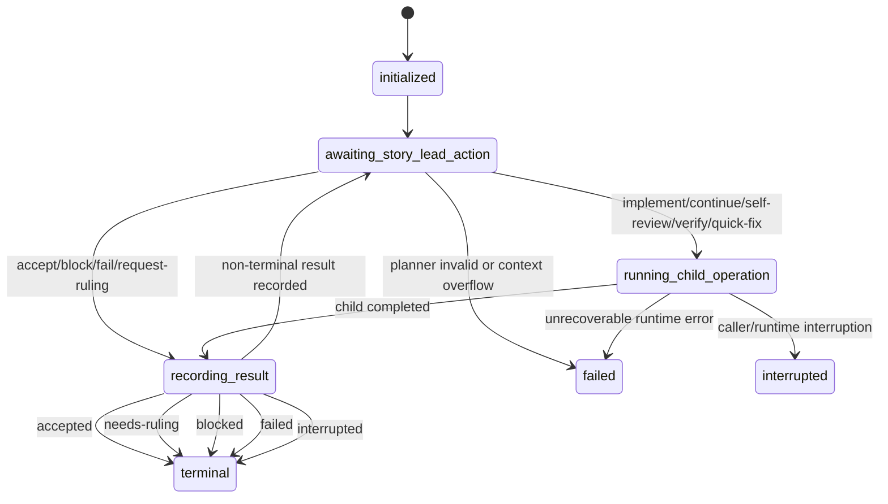

# Story Cycle

Stage 3 runs once per story in order. The normal happy path is `story-orchestrate`: launch one story, let the runtime drive the bounded child operations, review the final package, then finish impl-lead acceptance yourself. Primitive commands remain available as lower-level building blocks, recovery tools, and direct diagnosis tools when you need them.

Treat `story-orchestrate` as a story-lead helper for one story rather than as outer acceptance authority. Story-lead can own the internal story loop and hand back a final package, but impl-lead still reviews that package, finishes the receipt, makes the story commit, and decides whether the story is actually accepted.

## Local CLI on this branch

When you are dogfooding unreleased commands on the current branch, use the local CLI:

- `npm exec -- lbuild-impl ...`
- `node dist/bin/lbuild-impl.js ...`

The global `lbuild-impl` on `PATH` is the published package. If a command exists locally but not globally, switch to the local CLI instead of treating the missing global command as a product defect.

## Story-orchestrate lifecycle

`story-orchestrate` keeps two vocabularies visible at the same time:

- `status` stays caller-facing: `running`, `accepted`, `needs-ruling`, `blocked`, `failed`, `interrupted`
- `lifecycleState` explains where the current attempt sits inside the story-lead loop: `initialized`, `awaiting_story_lead_action`, `running_child_operation`, `recording_result`, `terminal`



Caller implications:

- `initialized` means setup exists but no planner turn has safely started yet.
- `awaiting_story_lead_action` means the next fresh planner turn should return exactly one bounded action.
- `running_child_operation` means the runtime is executing one bounded step, so keep polling durable artifacts instead of rerouting blindly.
- `recording_result` means the runtime is writing evidence and ledger updates before it claims the next state.
- `terminal` means read the public `status` plus the final package to decide the impl-lead follow-up.

Terminal `status` meanings:

- `accepted` still requires impl-lead review, receipt completion, gates, and the story commit.
- `needs-ruling` means the story hit an authority boundary and the caller must decide.
- `blocked` means a named blocker prevented safe progress.
- `failed` means the attempt ended in an unrecoverable runtime or planner failure.
- `interrupted` means resume from the last durable checkpoint rather than guessing from memory.

Update `State` and `Current Phase` in `team-impl-log.md` as you move through the steps. Recovery uses these values to resume from the right place.

| Step | State | Current Phase |
|---|---|---|
| 1 — Launch implementation | `STORY_ACTIVE` | `implement` |
| 2 — Launch self-review | `STORY_ACTIVE` | `self-review` |
| 3 — Launch verification | `STORY_ACTIVE` | `verify` |
| Consulting `21-verification-and-fix-routing.md` | `STORY_ACTIVE` | `fix-routing` |
| 4–5 — Story gate + baseline check | `STORY_ACTIVE` | `gate` |
| 6 — Receipt and commit | `STORY_ACTIVE` | `accept` |
| Advance between stories | `BETWEEN_STORIES` | — |

## Confirm the active story

Before any work, confirm which story is active from the ordered story list in `team-impl-log.md`. At the start of a new story, confirm `Current Story` matches the story file you're about to implement.

When you background any provider-backed CLI call in this phase, keep following its runtime progress on the heartbeat cadence instead of waiting only on the background job notification. This avoids the failure mode where the orchestrator waits indefinitely on a hung task even though `status.json`, `updatedAt`, `lastOutputAt`, or the stream logs already show that something is wrong. Use `references/ls-impl-process-playbook.md` for the polling procedure.

- In Codex, keep the same exec session open, poll again with empty input, and do not final while the command is still active.
- In Claude Code, Monitor may be used when available; do not assume that Monitor exists in Codex.
- Heartbeats are summaries on `stderr`, not replacements for the final JSON envelope on `stdout`.
- The caller harness receives the heartbeat. The provider harness may be different.

## Normal story path

Start normal story work with `story-orchestrate`. The runtime will call lower-level story operations for you one bounded step at a time and persist the durable story-run record between planner turns.

## 1. Launch story-orchestrate

```bash
lbuild-impl story-orchestrate run --spec-pack-root <path> --story-id <story-id> --json
```

Route on the terminal `status`:

- **`accepted`** — review the final package, run the final story gate yourself, complete the receipt, make the story commit, and only then accept the story.
- **`needs-ruling`** — pause and supply the caller decision the story-lead asked for.
- **`blocked`** — inspect the named blocker, resolve the prerequisite or escalate it, then resume or rerun intentionally.
- **`failed`** — inspect the runtime or planner failure evidence, fix the root cause, then rerun or resume from a clean decision.
- **`interrupted`** — resume from the last durable checkpoint instead of reconstructing progress from memory.

## 2. Poll status while the attempt is active

```bash
lbuild-impl story-orchestrate status --spec-pack-root <path> --story-id <story-id> --json
```

Use `status`, `lifecycleState`, the latest event, and the final package path to decide whether to keep waiting, resume, or move into impl-lead acceptance work.

## 3. Resume or reopen intentionally

Resume from the durable story-run record when the story-lead asks for review input or a ruling, or when an interrupted attempt needs to continue from disk:

```bash
lbuild-impl story-orchestrate resume --spec-pack-root <path> --story-id <story-id> [--story-run-id <id>] [--review-request-file <path>] [--ruling-file <path>] --json
```

Use `spec-pack-root + story-id` as the stable recovery key when the story run id is missing. Resume only the smallest missing bounded step that is not already backed by a valid durable artifact.

## 4. Finish impl-lead acceptance yourself

`story-orchestrate` does not accept the story for you. After an `accepted` terminal result:

- run the story gate command recorded in `team-impl-log.md`
- compare the cumulative test baseline to the prior accepted baseline
- write the receipt in `team-impl-log.md`
- record every unresolved finding disposition
- land the story commit before advancing

Include these receipt fields when story-lead was used:

- any `story-orchestrate` final package, `logHandoff`, and story receipt draft paths
- any `accepted-risk` or `defer` items; carry them forward into the cleanup batch before epic verification

The commit is part of acceptance: until it lands, the story remains in `accept` phase and recovery should expect the commit before advancing.

For targeted test slices while diagnosing story work, use the command for the Vitest project you need:

```bash
# default/unit slices
bun run test -- --run <files>

# package slices
npm run test:package -- --run <files>
```

Do not use raw `bun test`; it bypasses the repo Vitest configuration and is not an accepted verification path.

## Lower-level story operations

Primitive story operations stay available, but they are lower-level tools rather than the default story workflow:

- `story-implement` — initial retained implementor pass when you intentionally bypass or reconstruct part of the composed loop
- `story-continue` — same-session implementor follow-up after verifier findings or recovery
- `story-self-review` — explicit same-session implementor review before verification
- `story-verify` — retained verifier passes for one story
- `quick-fix` — narrow, story-agnostic correction when the smallest safe fix does not need the full story session

Reach for these primitives when:

- `story-orchestrate` status or final evidence shows a specific missing bounded step
- you are doing direct diagnosis or maintainer recovery work
- the user explicitly asks for the lower-level operation

## Advance

Update `Current Story` in the log:

- If more stories remain — set `Current Story` to the next story, `State` to `BETWEEN_STORIES`, and return to step 1.
- If this was the last story — set `State` to `PRE_EPIC_VERIFY` and proceed to `phases/23-cleanup-and-closeout.md`.
